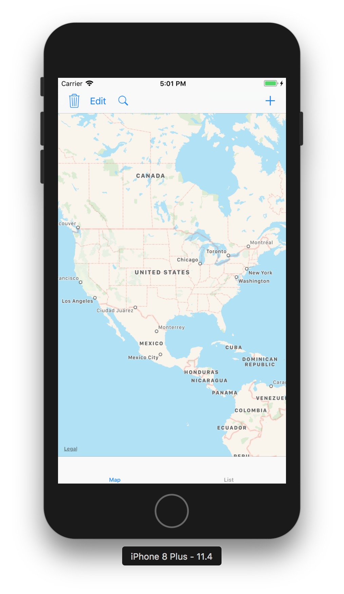
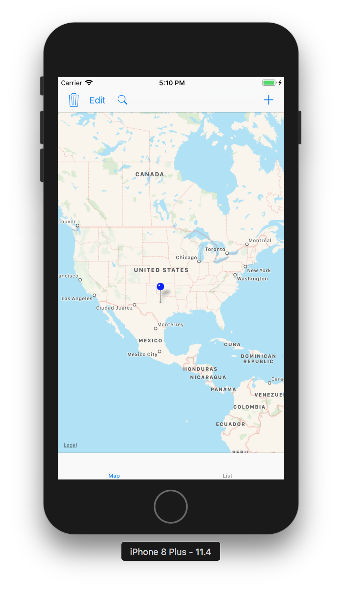
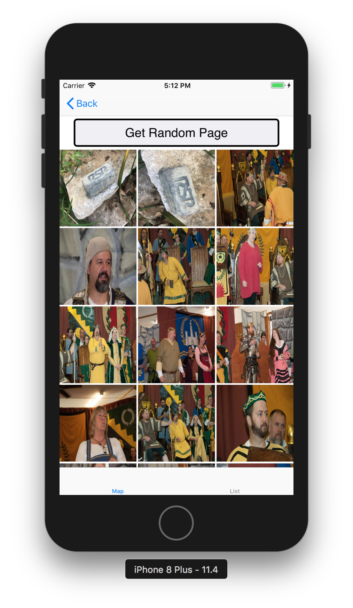
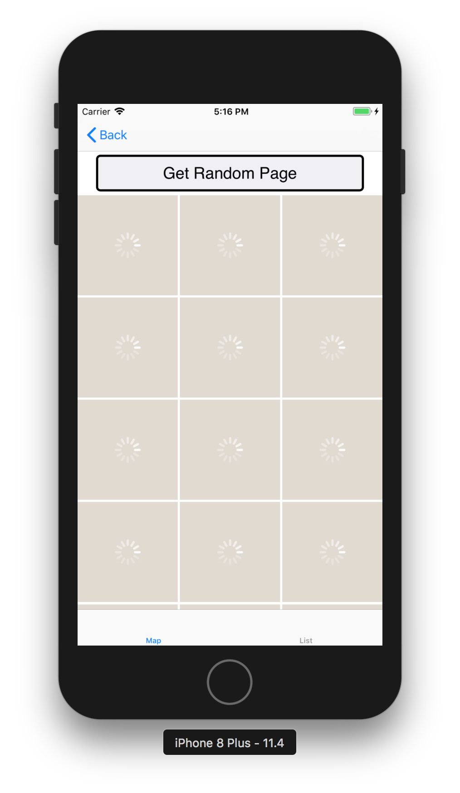
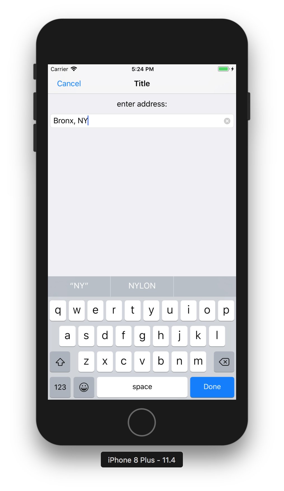
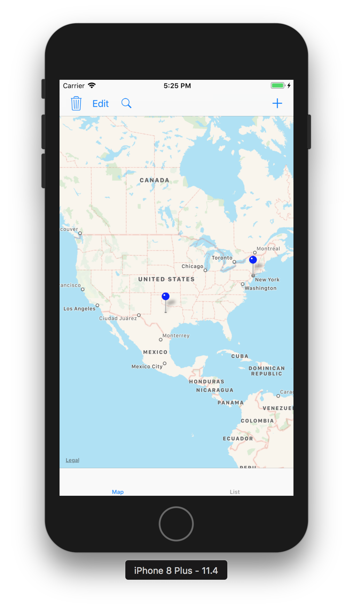

#  TrippNmemes
Licensing information: Read License

Author and Contributors List
------
Norbert Grover

All discovered bugs can be forewarded to sosagrover1987@gmail.com

Project Repository is at:
------ 
https://github.com/Pac12Run8000/FlickVisitR

How to use FlickVisitR
======
1. When you start up the application, you will see a Map. If you go all the way to the bottom, you can see the tabs of a tabbar controller. You can select from either a MapView or a TableView.

2. If you click and hold on the map, a pin will be added to that map surface. 

3. Click on the pin and you can see images from the location on the map.

4. If you tap the refresh button, you can see more images from this location.

5. If you click on the plus button "+", you will navigate to a controller where you can enter an address and once you click the done button, you will be returned to the map and a pin will be dropped on the location that correlates to the address that you entered.

License
------
THE SOFTWARE IS PROVIDED "AS IS", WITHOUT WARRANTY OF ANY KIND, EXPRESS OR IMPLIED, INCLUDING BUT NOT LIMITED TO THE WARRANTIES OF MERCHANTABILITY, FITNESS FOR A PARTICULAR PURPOSE AND NONINFRINGEMENT. IN NO EVENT SHALL THE AUTHORS OR COPYRIGHT HOLDERS BE LIABLE FOR ANY CLAIM, DAMAGES OR OTHER LIABILITY, WHETHER IN AN ACTION OF CONTRACT, TORT OR OTHERWISE, ARISING FROM, OUT OF OR IN CONNECTION WITH THE SOFTWARE OR THE USE OR OTHER DEALINGS IN THE SOFTWARE.
